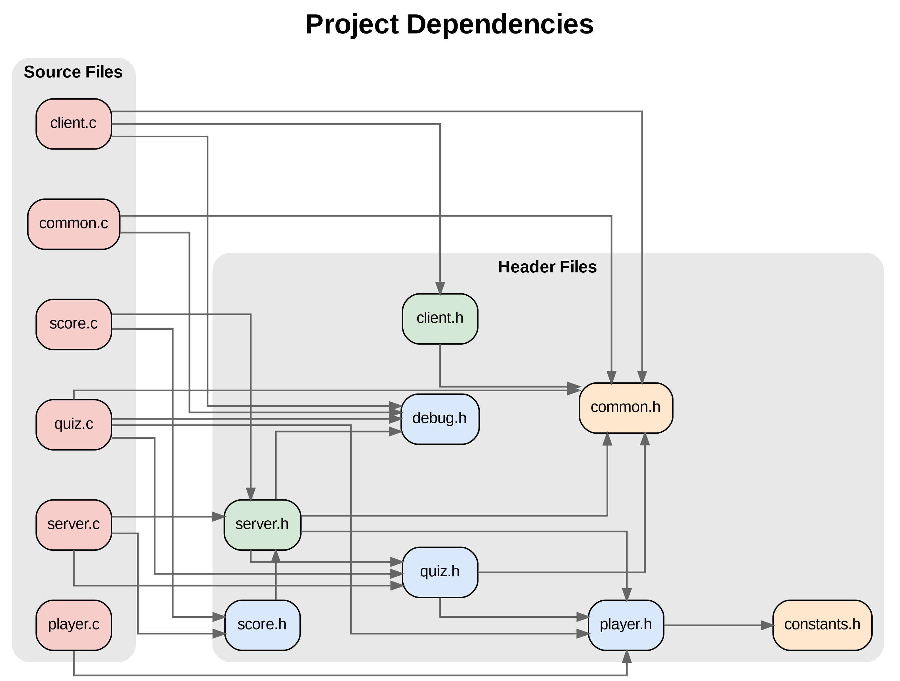

# Trivia Quiz Multiplayer



### Descrizione
Questo progetto implementa un gioco di quiz multiplayer client-server in C. Il sistema permette a più giocatori di partecipare contemporaneamente a quiz su diversi temi (Sport e Geografia), mantenendo punteggi e classifiche separate per ogni tema. Essendo a basso livello, il progetto è stato sviluppato con l'obiettivo di fornire una base solida per l'apprendimento dei concetti di programmazione di rete.

## Caratteristiche Principali

- Supporto multiplayer con gestione concorrente dei client
- Due temi di quiz disponibili (Sport e Geografia)
- 5 domande casuali per ogni sessione di quiz
- Sistema di punteggio (1 punto per risposta corretta, 0 per risposta sbagliata)
- Classifica in tempo reale
- Possibilità di visualizzare i punteggi durante il gioco
- Gestione nickname univoci per i giocatori
- Tracciamento dei quiz completati per ogni giocatore

## Requisiti di Sistema

- Compilatore: GCC v.13
- Make

## Installazione
```bash
# Clone the repository
git clone https://github.com/AndreaCovelli/progetto_reti_informatiche.git

# Navigate to project directory
cd progetto_reti_informatiche

# Compile the project
make
```

### Struttura dei File Quiz
I file dei quiz devono essere posizionati nella cartella `res/` con la seguente struttura:
- `res/sport_quiz.txt`
- `res/geography_quiz.txt`

Formato del file:
```
Nome del tema
Domanda-1 | Risposta-1, Risposta-2, Risposta-3, Risposta-4, Risposta-5
Domanda-2 | Risposta-1, Risposta-2...
...
```
Eventuali leading o trailing spaces, righe che non rispettano la formattazione sopra, vengono ignorati automaticamente.

## Utilizzo
### Avvio del Server
```bash
./server <porta>
```

### Avvio del Client
```bash
./client <indirizzo IP> <porta>
```
### Comandi Disponibili Durante il Quiz
- `show score`: Visualizza la classifica in tempo reale
- `endquiz`: Abbandona il quiz

## Funzionalità Dettagliate
### Server
- Gestione concorrente dei client tramite I/O multiplexing (`select`)
- Selezione casuale delle domande per ogni sessione
- Gestione delle disconnessioni dei client
- Mantenimento delle classifiche e della sessione di gioco se il client si disconnette e non ha ancora completato tutti i quiz
- Validazione dei nickname

### Client

- Interfaccia testuale intuitiva
- Gestione della connessione/disconnessione
- Visualizzazione dei punteggi
- Possibilità di partecipare a quiz diversi

## Struttura del Progetto
```
.
├── include/        # Header files
├── obj/            # File oggetto (creata durante la compilazione)
├── res/            # File dei quiz
├── src/            # Source files
├── client
├── deps_png.dot
├── deps_svg.dot
├── domande_casuali_quiz.md
├── LICENSE
├── Makefile
├── pacchetto_progetto_triviaquiz.drawio
├── project_dependencies.png
├── project_dependencies.svg
├── ProjectStructure.txt
├── README.md
├── server
├── TriviaQuizClient.png
├── TriviaQuizClient.txt
├── TriviaQuizServer.png
└── TriviaQuizServer.txt
```

## Pulizia dei file oggetto
```bash
make clean
```

## Debug

Il progetto implementa un sistema di debug che permette di tracciare l'esecuzione del programma inserendo messaggi di log dettagliati. Questo sistema può essere attivato secondo le indicazioni sottostanti.

### Compilazione in modalità Debug

La compilazione in modalità debug si ottiene con:
```bash
make debug
```
Questo genera eseguibili specifici per il debug (`client_debug` e `server_debug`) che coesistono con le versioni release, permettendo di alternare facilmente tra le due modalità.
Inoltre abilita la macro DEBUG che attiva il sistema di logging.

### Sistema di Logging

Il sistema utilizza una macro `DEBUG_PRINT` configurabile che:
- Viene attivata solo nelle build di debug attraverso la definizione della macro `DEBUG`
- Traccia automaticamente messaggi di sistema critici come connessioni, disconnessioni e scambio di messaggi
- Fornisce informazioni dettagliate sul flusso di esecuzione senza interferire con le productions builds
- Indirizza l'output su `stderr` per separare i log di debug dall'output normale del programma

### Utilizzo per lo Sviluppo

Durante lo sviluppo è possibile:
- Osservare il flusso dettagliato della comunicazione client-server
- Tracciare lo stato interno del gioco
- Monitorare la gestione della memoria e delle risorse
- Identificare rapidamente problemi di comunicazione o di logica applicativa

La modalità debug si integra naturalmente con strumenti come gdb grazie all'inclusione dei simboli di debug (`-g`).

## Note Tecniche

- Il progetto utilizza il protocollo TCP per la comunicazione
- Implementa una gestione robusta degli errori
- Supporta la compilazione sia in modalità release che debug
- Utilizza strutture dati dinamiche per la gestione dei giocatori e delle domande, garantendo scalabilità e flessibilità

## Autore
- Andrea Covelli
- Corso: Reti Informatiche
- Anno Accademico: 2024/2025

## Licenza
<p xmlns:cc="http://creativecommons.org/ns#" xmlns:dct="http://purl.org/dc/terms/"><a property="dct:title" rel="cc:attributionURL" href="https://github.com/AndreaCovelli/progetto_reti">Trivia Quiz Multiplayer</a> by <a rel="cc:attributionURL dct:creator" property="cc:attributionName" href="https://github.com/AndreaCovelli">Andrea Covelli</a> is licensed under <a href="https://creativecommons.org/licenses/by/4.0/?ref=chooser-v1" target="_blank" rel="license noopener noreferrer" style="display:inline-block;">CC BY 4.0</a></p> 